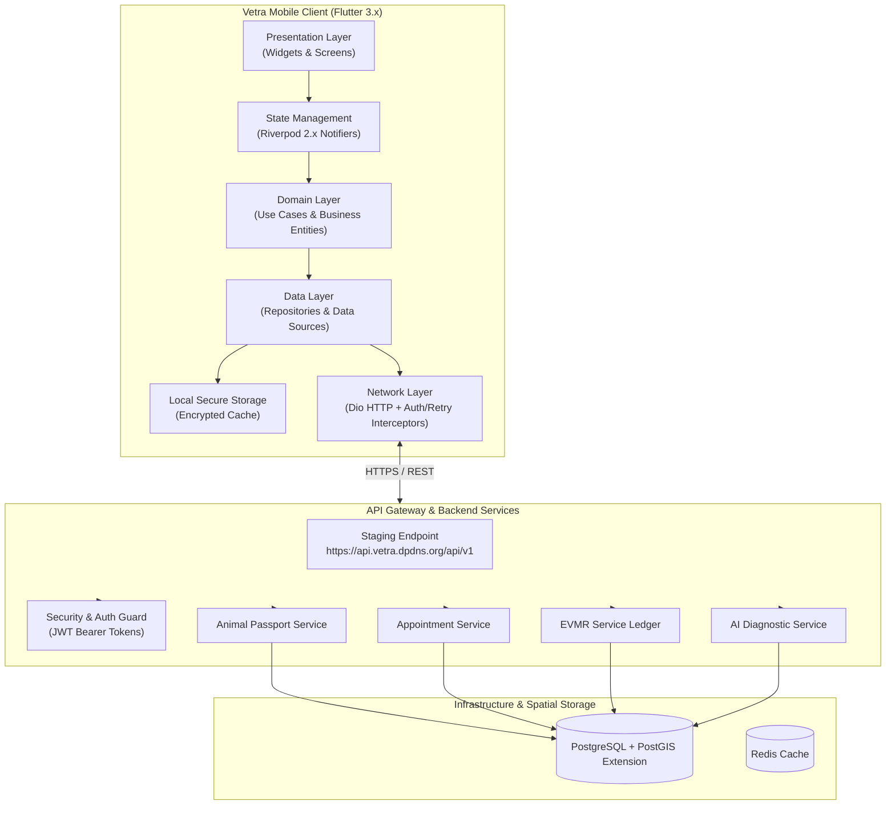
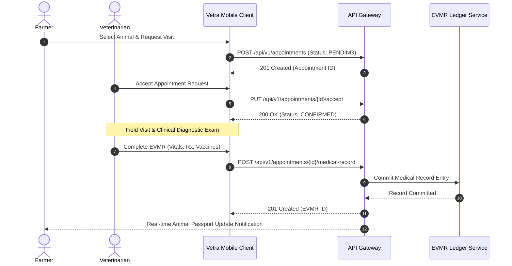

<div align="center">

  <h1>Vetra</h1>
  <p><b>Enterprise Veterinary Operating System (VetOS) & Field Livestock Infrastructure</b></p>

  <p>
    <a href="https://flutter.dev"></a>
    <a href="https://dart.dev"></a>
    <a href="https://riverpod.dev"></a>
    <a href="https://pub.dev/packages/go_router"></a>
    <a href="https://spring.io"></a>
    <a href="https://www.postgresql.org"></a>
    <a href="LICENSE"></a>
  </p>

  <p>
    <a href="#overview">Overview</a> •
    <a href="#core-capabilities">Capabilities</a> •
    <a href="#system-architecture">Architecture</a> •
    <a href="#project-structure">Project Structure</a> •
    <a href="#documentation-index">Documentation</a> •
    <a href="#quick-start">Quick Start</a> •
    <a href="#testing--verification">Testing</a>
  </p>

  ---
</div>

## Overview

Vetra (Veterinary Operating System / VetOS) is an enterprise mobile platform built for livestock health management and field veterinary medicine in rural environments.

Field veterinary operations in emerging agricultural markets face challenges around network connectivity, fragmented paper health records, delayed epidemic reporting, and unverified animal identities. Vetra addresses these operational gaps by pairing a **Flutter 3 Clean Architecture client** with **Spring Boot microservices** and **PostGIS spatial analytics**.

Key architectural features include:
- **Digital Animal Passport**: Cryptographic QR identity verification and immutable lifecycle health tracking.
- **Role-Based Access Control (RBAC)**: Strict navigation stack separation between Farmer and Veterinarian roles.
- **Electronic Veterinary Medical Records (EVMR)**: Field clinical diagnostic logs, treatment histories, and digital prescriptions.
- **Tele-Veterinary Consultations**: Asynchronous and scheduled appointment triage workflows.
- **Spatial Outbreak Surveillance**: PostGIS-backed epidemiological risk mapping and proximity alerts.
- **Offline Resilience**: Local encrypted state storage and background HTTP queueing for zero-connectivity zones.

---

## Core Capabilities

### Farmer Workflow
- **Herd Inventory**: Register livestock (cattle, buffalo, goats, sheep, swine) with species, breed, tag identifier, age, and photo attachments.
- **QR Identity Verification**: Generate and present encrypted QR passports for on-site scanning by field veterinarians and livestock inspectors.
- **Appointment Scheduling**: Request clinical visits, track booking state machine (`PENDING` -> `CONFIRMED` -> `COMPLETED` / `CANCELLED`), and specify visit context (On-Farm, Clinic, Emergency).
- **Medical History Timeline**: Access permanent health records, vaccination schedules, active prescriptions, and follow-up notices.

### Veterinarian Workflow
- **Triage Queue**: Review appointment requests, filter by clinical urgency, view farmer profiles, and accept or reschedule visit slots.
- **EVMR Workbench**: Record field diagnostics, vital signs, subcutaneous/intramuscular treatment procedures, and digital signatures.
- **Prescriptions & Vaccines**: Issue formal pharmaceutical regimens and schedule automated booster reminders.
- **Epidemiological Reporting**: Flag suspected infectious disease cases and visualize PostGIS disease vector radii.

---

## System Architecture

Vetra enforces strict Clean Architecture conventions with unidirectional data flows (Presentation --> Domain <-- Data).

### End-to-End System Topology



### EVMR Consultation Sequence



---

## Project Structure

The client application isolates business logic from UI and data source implementations:

```
vetra/
├── assets/                   # SVG vector icons and visual assets
├── docs/                     # Engineering, architecture, and design specifications
│   ├── architecture/         # Software Architecture Document (SAD) and ADRs
│   ├── engineering/          # Coding standards, git workflow, principles
│   ├── guides/               # Developer onboarding and testing guidelines
│   ├── product/              # Product Requirements Document (PRD)
│   └── design/               # Design system and navigation specifications
├── lib/
│   ├── core/                 # Shared infrastructure abstractions
│   │   ├── config/           # AppConfig, ApiConfig, environment setup
│   │   ├── design_system/    # Visual components, typography, layout tokens
│   │   ├── models/           # Common DTO wrappers (ApiResponse<T>)
│   │   ├── network/          # Dio client, AuthInterceptor, RetryInterceptor, SanitizedLogger
│   │   ├── router/           # GoRouter declarative router and RBAC guards
│   │   └── storage/          # Encrypted secure storage wrappers
│   └── features/             # Domain Feature Modules
│       ├── ai/               # Diagnostic assistance tools
│       ├── animal/           # Digital passport, tag management, QR scanning
│       ├── appointment/      # Consultation scheduling and status engine
│       ├── auth/             # Authentication, session, and token management
│       ├── dashboard/        # Role-based dashboard analytics
│       ├── disease/          # Outbreak reporting and spatial alerts
│       ├── farmer/           # Farmer portal and herd management
│       ├── maps/             # PostGIS disease heatmaps and spatial radius view
│       ├── medical_record/   # EVMR creation and medical timeline
│       ├── profile/          # User profile and clinic settings
│       ├── settings/         # Preferences, language selection, API endpoints
│       └── veterinarian/     # Field vet queue, triage, and consultation tools
└── test/                     # Automated unit, widget, contract, and integration tests
```

---

## Capability Matrix

| Feature Module | Farmer Role | Field Veterinarian Role | System Administrator |
| :--- | :--- | :--- | :--- |
| **Animal Registration** | Create & Update | View & Verify | Global System Audit |
| **QR Code Verification** | Generate & Share | Scan & Validate | Audit Logs |
| **Appointments** | Request & Cancel | Accept & Complete | Overview Analytics |
| **EVMR Ledger** | View Timeline | Create & Sign Records | Compliance Audit |
| **Prescriptions** | Read Active Rx | Authorize Regimen | Regulatory Monitoring |
| **Disease Outbreak Map** | View Area Alerts | Report Outbreak Case | PostGIS Spatial Analysis |
| **Offline Sync** | Local Cache | Field Queue Sync | System State Reconciliation |

---

## Documentation Index

Detailed engineering documentation and architecture whitepapers are available in the repository:

### Architecture Whitepapers
- [VETRA Concept Architecture](VETRA_Concept_Architecture_Engineering_Om_Rajput.pdf) — Strategic Vision & Engineering Overview
- [VETRA API & Backend Architecture](VETRA_Doc02_API_Backend_Architecture_Om_Rajput.pdf) — Microservices Design & API Specifications
- [VETRA AI Architecture](VETRA_Doc03_AI_Architecture_Om_Rajput.pdf) — Diagnostic Computer Vision & Predictive Models
- [VETRA Cloud Infrastructure](VETRA_Doc04_Cloud_Infrastructure_Om_Rajput.pdf) — Deployment Topology, AWS & Kubernetes
- [VETRA Mobile Engineering](VETRA_Doc05_Mobile_Engineering_Om_Rajput.pdf) — Flutter Clean Architecture Deep Dive
- [VETRA Quality & Reliability](VETRA_Doc06_Quality_Reliability_Om_Rajput.pdf) — Reliability Benchmarks & Testing Strategy

### System Specifications
- [Engineering Principles](docs/engineering/00-principles.md) — Architectural constitution and guidelines
- [Product Requirements Document (PRD v2.0.0)](docs/product/01-PRD.md) — Functional and non-functional specifications
- [Software Architecture Document (SAD)](docs/architecture/02-SAD.md) — System design and component layout
- [Architecture Decision Records (ADRs)](docs/architecture/adr/INDEX.md) — ADR-001 through ADR-005
- [Design System Specification](docs/design/VETRA_DESIGN.md) — Design tokens, typography, and contrast rules
- [Navigation Graph](docs/design/NAVIGATION_GRAPH.md) — Routing hierarchy and RBAC guards
- [Developer Onboarding Guide](docs/guides/20-developer-onboarding.md) — Environment setup and workflow guide
- [Testing Strategy](docs/guides/14-testing-strategy.md) — Test pyramid and coverage rules
- [Backend Integration Guide](docs/api/backend-integration.md) — API contract definitions and DTO schemas

---

## Quick Start

### Prerequisites
- **Flutter SDK**: `^3.22.0` (Stable)
- **Dart SDK**: `^3.4.0`
- **Android SDK**: API level 34+
- **Xcode**: 15+ (for iOS builds)
- **Java**: 17+ (for backend integration)

### Setup Instructions

1. Clone the repository and install dependencies:
   ```bash
   git clone https://github.com/omrajput14/vetra.git
   cd vetra
   flutter pub get
   ```

2. Run code generation for serialization and state models:
   ```bash
   dart run build_runner build --delete-conflicting-outputs
   ```

3. Execute static analysis and tests:
   ```bash
   flutter analyze
   flutter test
   ```

4. Launch the application:
   ```bash
   flutter run
   ```

By default, the client points to the live AWS staging endpoint (`https://api.vetra.dpdns.org/api/v1`). To use a local backend (`http://10.0.2.2:8080`), update `ApiConfig.baseUrl` in [`lib/core/config/api_config.dart`](file:///Users/0mrajput/vetra/lib/core/config/api_config.dart).

---

## Testing & Verification

The repository includes test suites covering all layers of the Clean Architecture model:

- **Unit Tests**: Domain logic, model serialization, entity validation, and state notifiers.
- **Widget Tests**: Component rendering, input validation, and layout responsive bounds.
- **Contract Tests**: End-to-end payload serialization against backend JSON schemas.
- **Integration Tests**: Live end-to-end integration verification against staging environments.

To execute the complete test suite:
```bash
flutter test --reporter expanded
```

---

## Security Infrastructure

- **Token Lifecycle Management**: Short-lived JWT access tokens with encrypted refresh token storage and automatic refresh flows via `AuthInterceptor`.
- **Log Sanitization**: Request/response headers and sensitive payloads are redacted prior to logging using `SanitizedLogInterceptor`.
- **RBAC Navigation Enforcement**: Declarative route guards prevent unauthorized access between Farmer and Veterinarian interface stacks.

---

## License

This project is licensed under the MIT License. See [LICENSE](LICENSE) for details.
