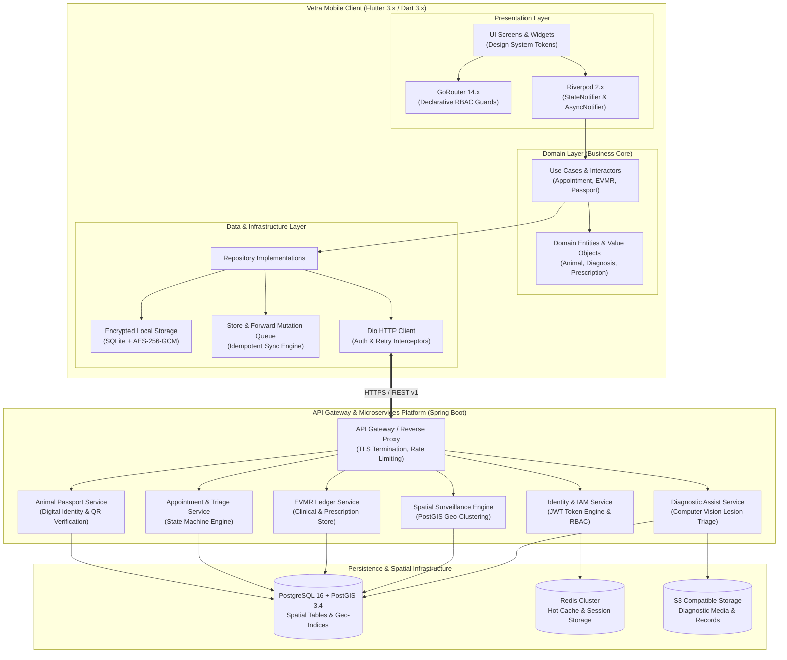
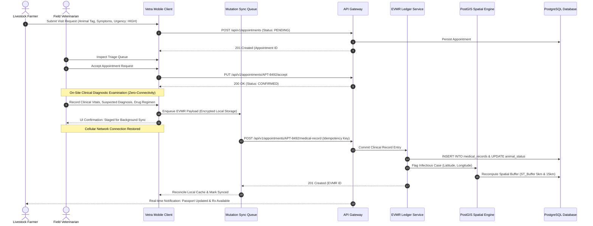
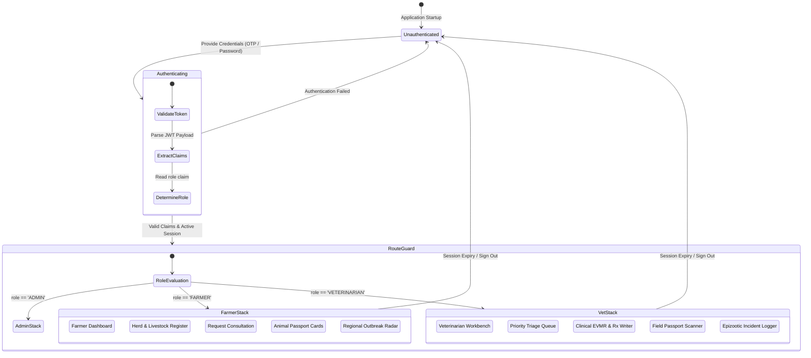
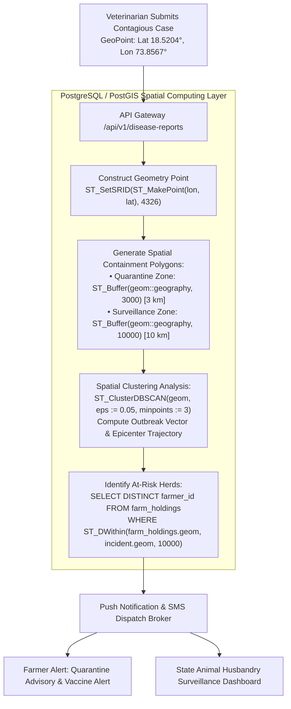
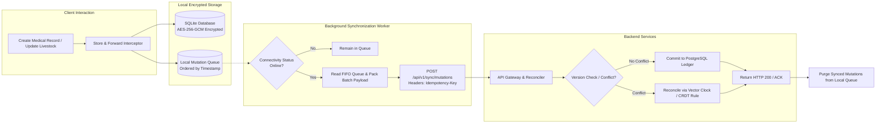

<div align="center">

  

  <p align="center">
    <b>A mission-critical, offline-first clinical platform and spatial epidemiological surveillance engine for rural livestock ecosystems and field veterinary medicine.</b>
  </p>

  <p align="center">
    <a href="https://flutter.dev"></a>
    <a href="https://dart.dev"></a>
    <a href="https://spring.io/projects/spring-boot"></a>
    <a href="https://www.postgresql.org/"></a>
    <a href="https://riverpod.dev"></a>
    <a href="https://pub.dev/packages/go_router"></a>
  </p>

  <p align="center">
    
    
    
    
    
    
  </p>

  <p align="center">
    <a href="#executive-summary">Executive Summary</a> •
    <a href="#core-capabilities">Core Capabilities</a> •
    <a href="#system-architecture">System Architecture</a> •
    <a href="#spatial-surveillance-engine">Spatial Surveillance</a> •
    <a href="#offline-first-synchronization-pipeline">Offline Sync</a> •
    <a href="#clean-architecture--directory-topology">Codebase Topology</a> •
    <a href="#api-contracts--data-models">API Contracts</a> •
    <a href="#engineering-team">Engineering Team</a> •
    <a href="#quick-start--local-orchestration">Quick Start</a> •
    <a href="#testing--verification">Testing</a>
  </p>

  ---
</div>

<br/>

## Executive Summary

Field veterinary healthcare in rural agricultural ecosystems operates under severe infrastructure constraints:
- **Zero-Connectivity Zones**: Over 65% of rural farming regions lack dependable cellular networks, leading to data dropouts and fragmented paper logs.
- **Delayed Outbreak Interception**: Highly contagious epizootic diseases (e.g., Foot-and-Mouth Disease, Lumpy Skin Disease, Brucellosis) often spread unchecked due to batch-based, non-geolocated reporting.
- **Unverified Identity & Health History**: Absence of verifiable digital identity enables livestock identity fraud and invalidates vaccination audit trails.
- **Triage Inefficiency**: Rural veterinarians lack clinical prioritization engines, slowing response times during acute emergency cases.

**Vetra (Veterinary Operating System / VetOS)** solves these challenges through an enterprise-grade mobile application pairing a **Flutter 3 Clean Architecture** client with **Spring Boot microservices**, **PostGIS spatial clustering**, **cryptographic Ed25519 animal passports**, and an **offline-first store-and-forward sync pipeline**.

---

## Core Capabilities

<table>
  <thead>
    <tr>
      <th width="50%" align="left">Farmer Portal</th>
      <th width="50%" align="left">Veterinarian Operating System (VetOS)</th>
    </tr>
  </thead>
  <tbody>
    <tr>
      <td valign="top">
        <ul>
          <li><b>Livestock Inventory:</b> Register cattle, buffalo, sheep, goats, and swine with breed, age, visual identifiers, and RFID tag IDs.</li>
          <li><b>Cryptographic QR Passport:</b> Present tamper-proof digital passports for field inspection and health history verification.</li>
          <li><b>Triage-Aware Scheduling:</b> Request on-farm or clinical visits with urgency tags, symptom notes, and booking state tracking.</li>
          <li><b>Medical Record Timeline:</b> Access full diagnostic histories, active digital prescriptions, withdrawal alerts, and booster dates.</li>
        </ul>
      </td>
      <td valign="top">
        <ul>
          <li><b>Urgency Triage Queue:</b> Filter consultation requests by clinical severity, location proximity, and herd status.</li>
          <li><b>Field EVMR Workbench:</b> Record vitals, diagnostic notes, procedural treatments, and issue cryptographically signed prescriptions.</li>
          <li><b>Offline Field Queue:</b> Queue clinical entries securely in local storage; sync automatically when connectivity resumes.</li>
          <li><b>Outbreak Reporting:</b> Flag infectious cases instantly to trigger automated PostGIS spatial containment radii.</li>
        </ul>
      </td>
    </tr>
  </tbody>
</table>

---

## System Architecture

Vetra enforces strict **Clean Architecture** conventions with unidirectional data flow and dependency inversion: `Presentation Layer -> Domain Layer <- Data Layer`.

### 1. End-to-End System Topology



---

### 2. EVMR Clinical Consultation & Immutable Ledger Sequence



---

### 3. Cryptographic Animal Passport Lifecycle

```mermaid
flowchart LR
    subgraph Registration ["1. Animal Registration"]
        A[Enter Livestock Attributes:\nTag ID, Species, Breed, DOB] --> B[Generate Canonical Payload\n& UUID v4 Identity]
        B --> C[Compute SHA-256 Hash\nof Canonical Metadata]
        C --> D[Sign with Authority Key\nEd25519 Cryptographic Signature]
    end

    subgraph Packaging ["2. QR Passport Encoding"]
        D --> E[Serialize Compact Binary / CBOR Payload\n{TagID, Hash, Signature, Expiry}]
        E --> F[Render QR Code\nError Correction Level H]
    end

    subgraph Verification ["3. Offline Field Inspection"]
        F --> G[Field Inspector / Veterinarian\nScans QR Code]
        G --> H[Extract Payload & Signature]
        H --> I{Verify Against Cached\nAuthority Public Key?}
        I -->|Valid| J[Authentic Identity Confirmed\nDisplay Full Medical Ledger]
        I -->|Invalid| K[Tamper Alert Triggered\nFlag Identity for Audit]
    end
```

---

### 4. Role-Based Access Control (RBAC) & Router Guard Engine



---

## Spatial Surveillance Engine

Vetra integrates spatial computing directly into clinical workflows. When a veterinarian logs an infectious diagnosis, the PostGIS engine calculates transmission risk buffers and executes proximity queries to alert nearby livestock holdings.



---

## Offline-First Synchronization Pipeline



---

## Clean Architecture & Directory Topology

```
vetra/
├── .github/                      # CI/CD Workflows (Lint, Test, Docker Build)
├── assets/                       # Vector icons and visual identity tokens
├── docs/                         # Architecture, Product, and API Documentation
│   ├── architecture/             # Software Architecture Document (SAD) & ADRs
│   ├── engineering/              # Code standards, security baseline, git guidelines
│   ├── guides/                   # Developer onboarding, testing strategy
│   └── product/                  # Product Requirements Document (PRD)
├── lib/
│   ├── app.dart                  # Root MaterialApp with theme & routing injection
│   ├── main.dart                 # Application entrypoint & dependency bootstrap
│   ├── core/                     # Shared Foundation & Core Utilities
│   │   ├── config/               # AppConfig, ApiConfig, environment profiles
│   │   ├── constants/            # Global routes, keys, API endpoints
│   │   ├── design_system/        # Design tokens, typography, component library
│   │   ├── errors/               # Failure & Exception hierarchy
│   │   ├── models/               # Common response wrappers (ApiResponse<T>)
│   │   ├── network/              # Dio client, AuthInterceptor, RetryPolicy
│   │   ├── router/               # GoRouter declarative router & RBAC guards
│   │   ├── storage/              # Encrypted storage & local SQLite handlers
│   │   └── utils/                # Date helpers, cryptographic utilities, QR helpers
│   └── features/                 # Domain Feature Modules (Clean Architecture)
│       ├── ai/                   # AI Diagnostic Assistant & lesion assessment
│       ├── animal/               # Digital passport, tag registry, QR scanning
│       ├── appointment/          # Triage scheduler & consultation state machine
│       ├── auth/                 # Authentication, session lifecycle, token refresh
│       ├── dashboard/            # Role-based dashboard analytics
│       ├── disease/              # Spatial outbreak logging & surveillance alerts
│       ├── farmer/               # Herd inventory & farmer portal workflows
│       ├── maps/                 # Mapbox / OpenStreetMap PostGIS visualizer
│       ├── medical_record/       # EVMR ledger, diagnostics, digital prescriptions
│       └── veterinarian/         # Field triage queue & clinical workbench
└── test/                         # Comprehensive Multi-Tier Test Suites
    ├── unit/                     # Business logic, state notifiers, use case tests
    ├── widget/                   # UI widget isolation & responsive layout tests
    ├── contract/                 # Backend JSON Schema & DTO contract verifications
    └── integration/              # End-to-end user workflows & offline sync simulation
```

---

## Capability Matrix

<table>
  <thead>
    <tr>
      <th>System Feature</th>
      <th align="center">Farmer</th>
      <th align="center">Field Veterinarian</th>
      <th align="center">Para-Veterinary Assistant</th>
      <th align="center">Health Regulator / Admin</th>
    </tr>
  </thead>
  <tbody>
    <tr>
      <td><b>Animal Registration & Profiling</b></td>
      <td align="center">Create / Update</td>
      <td align="center">View / Verify</td>
      <td align="center">View Only</td>
      <td align="center">Audit Access</td>
    </tr>
    <tr>
      <td><b>Cryptographic QR Passport</b></td>
      <td align="center">Generate & Present</td>
      <td align="center">Offline Scan & Verify</td>
      <td align="center">Offline Scan & Verify</td>
      <td align="center">Global Revocation</td>
    </tr>
    <tr>
      <td><b>Consultation Scheduling</b></td>
      <td align="center">Request & Cancel</td>
      <td align="center">Triage & Accept</td>
      <td align="center">Assist / View</td>
      <td align="center">Metric Analytics</td>
    </tr>
    <tr>
      <td><b>EVMR Clinical Records</b></td>
      <td align="center">View Read-Only</td>
      <td align="center">Create, Sign & Update</td>
      <td align="center">Record Vitals Only</td>
      <td align="center">Compliance Audit</td>
    </tr>
    <tr>
      <td><b>Digital Prescriptions (Rx)</b></td>
      <td align="center">View Active Regimens</td>
      <td align="center">Issue & Authorize</td>
      <td align="center">Dispense Log</td>
      <td align="center">Controlled Drug Audit</td>
    </tr>
    <tr>
      <td><b>Spatial Outbreak Surveillance</b></td>
      <td align="center">Proximity Alerts</td>
      <td align="center">Log Outbreak Case</td>
      <td align="center">Log Outbreak Case</td>
      <td align="center">Quarantine Management</td>
    </tr>
    <tr>
      <td><b>Store-and-Forward Sync</b></td>
      <td align="center">Client Queue</td>
      <td align="center">Field Queue</td>
      <td align="center">Field Queue</td>
      <td align="center">Cluster Reconciliation</td>
    </tr>
  </tbody>
</table>

---

## API Contracts & Data Models

### REST Endpoints Specification

| Method | URI Route | Authorization Scope | Description |
| :--- | :--- | :--- | :--- |
| `POST` | `/api/v1/auth/token` | Public | Authenticate mobile credentials and issue JWT pair |
| `POST` | `/api/v1/animals` | `SCOPE_FARMER` | Register livestock and generate digital passport |
| `GET` | `/api/v1/animals/{tagId}/passport` | `SCOPE_AUTHENTICATED` | Retrieve encrypted passport payload and verification signature |
| `POST` | `/api/v1/appointments` | `SCOPE_FARMER` | Create veterinary consultation request |
| `PUT` | `/api/v1/appointments/{id}/triage` | `SCOPE_VETERINARIAN` | Update clinical urgency classification |
| `POST` | `/api/v1/appointments/{id}/evmr` | `SCOPE_VETERINARIAN` | Commit signed EVMR clinical record and prescription |
| `POST` | `/api/v1/surveillance/outbreak` | `SCOPE_VETERINARIAN` | Report suspected epizootic case and recalculate risk radius |
| `POST` | `/api/v1/sync/mutations` | `SCOPE_AUTHENTICATED` | Reconcile batch mutations from offline storage queue |

### Sample Ingestion Contract (`POST /api/v1/appointments/{id}/evmr`)

```json
{
  "appointmentId": "APT-84920",
  "animalTagId": "IN-MH-1029-8472",
  "veterinarianId": "VET-0294",
  "clinicalExamination": {
    "temperatureCelsius": 39.8,
    "heartRateBpm": 78,
    "respiratoryRateBpm": 26,
    "mucousMembrane": "PALE_ICTERIC",
    "rumenMotilityScore": 2
  },
  "diagnoses": [
    {
      "code": "ICD-VET-A04",
      "name": "Bovine Babesiosis",
      "type": "CONFIRMED",
      "isContagious": true
    }
  ],
  "treatments": [
    {
      "drugName": "Diminazene Aceturate",
      "dosageMgPerKg": 3.5,
      "route": "DEEP_INTRAMUSCULAR",
      "withdrawalPeriodDays": 21
    }
  ],
  "geoCoordinate": {
    "latitude": 18.52043,
    "longitude": 73.85674,
    "altitudeMeters": 560.2
  },
  "timestamp": "2026-08-30T02:45:00Z",
  "digitalSignature": "e3b0c44298fc1c149afbf4c8996fb92427ae41e4649b934ca495991b7852b855"
}
```

---

## Security & Data Integrity

1. **Short-Lived JWT Tokens**: Ephemeral 15-minute access tokens with encrypted refresh token rotation.
2. **Deterministic PII Sanitization**: `SanitizedLogInterceptor` scrubs identity tokens, GPS micro-offsets, and user contact details prior to logging.
3. **Encrypted Storage at Rest**: Local SQLite database and cached files are protected with **AES-256-GCM** encryption keys held in the platform Keystore / Keychain.
4. **Asymmetric Verification**: Clinical records and passport QR codes are signed using **Ed25519** keypairs, allowing offline verification without internet access.

---

## Engineering Team

<table>
  <thead>
    <tr>
      <th align="left">Name</th>
      <th align="left">Role</th>
      <th align="left">Core Focus & Architectural Domain</th>
    </tr>
  </thead>
  <tbody>
    <tr>
      <td><b>Om Rajput</b></td>
      <td>Chief Systems Architect & Lead Engineer</td>
      <td>Flutter Clean Architecture, System Core, PostGIS Spatial Engine, Offline Sync Pipeline</td>
    </tr>
    <tr>
      <td><b>Mrunmai Joshi</b></td>
      <td>Product & Technical Project Manager</td>
      <td>Domain Architecture, Product Strategy, Sprint Execution, Clinical Workflow Compliance</td>
    </tr>
    <tr>
      <td><b>Khushi</b></td>
      <td>Cloud Developer & Communication Lead</td>
      <td>Cloud Infrastructure, API Gateway Integration, Stakeholder Comms & Technical Narrative</td>
    </tr>
    <tr>
      <td><b>Soham</b></td>
      <td>Fullstack Developer</td>
      <td>Spring Boot Microservices, REST Contract Engineering, Persistence & Database Pipelines</td>
    </tr>
    <tr>
      <td><b>Prachi</b></td>
      <td>UI/UX Designer & Presentation Lead</td>
      <td>Design System Architecture, User Journey Mapping, Visual Assets & Pitch Decks</td>
    </tr>
    <tr>
      <td><b>Dhiraj</b></td>
      <td>Research & QA Testing Lead</td>
      <td>Veterinary Domain Research, Multi-Tier Test Automation, Field Validation & Quality Gates</td>
    </tr>
  </tbody>
</table>

---

## Quick Start & Local Orchestration

### Prerequisites
- **Flutter SDK**: `^3.22.0` (Stable)
- **Dart SDK**: `^3.4.0`
- **Java**: `JDK 17+` or `JDK 21 LTS`
- **Docker Engine & Docker Compose**: `v24+`

---

### 1. Clone & Fetch Dependencies

```bash
git clone https://github.com/omrajput14/vetra.git
cd vetra
flutter pub get
```

---

### 2. Code Generation

Generate immutable entities, Riverpod providers, and JSON serialization files:

```bash
dart run build_runner build --delete-conflicting-outputs
```

---

### 3. Spin Up Local Backend Services (Optional)

```bash
docker compose -f docker-compose.local.yml up -d
```

---

### 4. Configure Environment Endpoints

Update target host configuration in `lib/core/config/api_config.dart`:

```dart
class ApiConfig {
  static const String stagingBaseUrl = 'https://api.vetra.dpdns.org/api/v1';
  static const String localBaseUrl = 'http://10.0.2.2:8080/api/v1';

  static String get baseUrl => kReleaseMode ? stagingBaseUrl : localBaseUrl;
}
```

---

### 5. Run Application

```bash
flutter run
```

---

## Testing & Verification

Vetra enforces strict quality gates with a **90%+ test coverage baseline**:

```
              ┌───────────────────────────┐
              │    E2E Integration (5%)   │ -> Staging Gateway & Database Verification
              ├───────────────────────────┤
              │   Contract Tests (15%)    │ -> JSON Schema & DTO Payload Validation
              ├───────────────────────────┤
              │    Widget Tests (30%)     │ -> UI Component Rendering & State Bounds
              ├───────────────────────────┤
              │     Unit Tests (50%)      │ -> Domain Logic, UseCases, Crypto & Notifiers
              └───────────────────────────┘
```

### Run Test Suites

```bash
# Execute static analysis
flutter analyze --fatal-infos

# Run unit and widget test suites
flutter test --reporter expanded

# Run tests with coverage profiling
flutter test --coverage
genhtml coverage/lcov.info -o coverage/html

# Run contract tests
flutter test test/contract/
```

---

## Documentation Index

| Specification | Document Purpose | Direct Link |
| :--- | :--- | :--- |
| **Doc 01: Concept Architecture** | Strategic Vision, Rural Domain Analysis & Field Ergonomics | [PDF Architecture Whitepaper](VETRA_Concept_Architecture_Engineering_Om_Rajput.pdf) |
| **Doc 02: API & Backend Services** | Microservices Design, PostGIS Query Plans & API Contracts | [PDF Architecture Whitepaper](VETRA_Doc02_API_Backend_Architecture_Om_Rajput.pdf) |
| **Doc 03: AI Architecture** | Lesion Recognition Models, Computer Vision Triage Pipeline | [PDF Architecture Whitepaper](VETRA_Doc03_AI_Architecture_Om_Rajput.pdf) |
| **Doc 04: Cloud Infrastructure** | AWS ECS, EKS, RDS PostGIS, Terraform Blueprints | [PDF Architecture Whitepaper](VETRA_Doc04_Cloud_Infrastructure_Om_Rajput.pdf) |
| **Doc 05: Mobile Engineering** | Flutter Clean Architecture, Riverpod State, Offline Engine | [PDF Architecture Whitepaper](VETRA_Doc05_Mobile_Engineering_Om_Rajput.pdf) |
| **Doc 06: Quality & Reliability** | Reliability Benchmarks, Chaos Engineering & Test Strategy | [PDF Architecture Whitepaper](VETRA_Doc06_Quality_Reliability_Om_Rajput.pdf) |

---

## License

This project is licensed under the **MIT License**. See the [LICENSE](LICENSE) file for details.

<div align="center">
  <sub>Developed for enterprise livestock health management, field veterinary resilience, and epidemiological surveillance.</sub>
</div>
