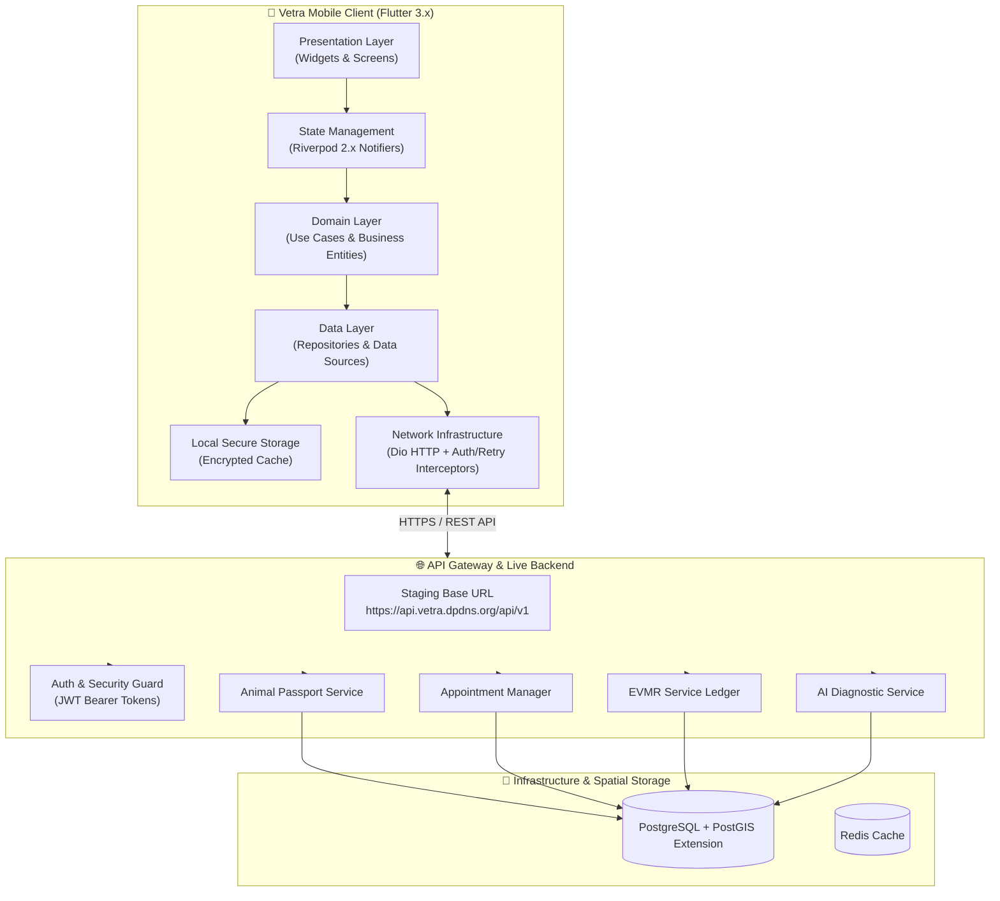
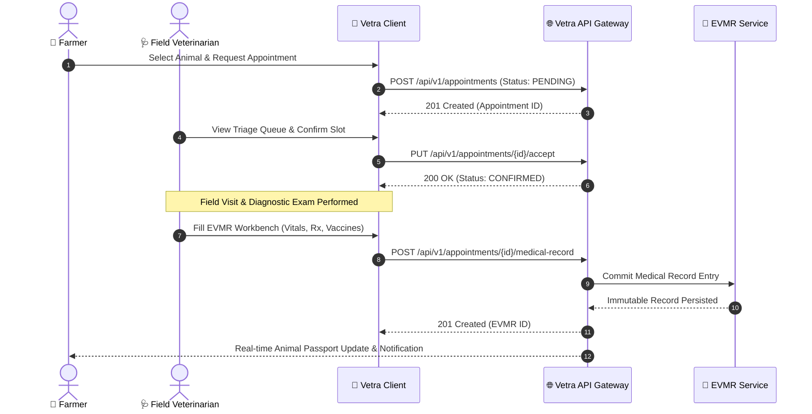

<div align="center">

  <h1>🐄 VETRA</h1>
  <h3>Enterprise Veterinary Operating System & Rural Livestock Health Platform</h3>

  <p>
    <b>Bridging field veterinarians and rural livestock farmers through digital animal identity, tele-veterinary consultations, AI diagnostic assistance, and resilient offline EVMR.</b>
  </p>

  <p>
    <a href="https://flutter.dev"></a>
    <a href="https://dart.dev"></a>
    <a href="https://riverpod.dev"></a>
    <a href="https://pub.dev/packages/go_router"></a>
    <a href="https://spring.io"></a>
    <a href="https://www.postgresql.org"></a>
    <a href="LICENSE"></a>
  </p>

  <p>
    <a href="#-executive-overview">Overview</a> •
    <a href="#-core-capabilities">Capabilities</a> •
    <a href="#-system-architecture">Architecture</a> •
    <a href="#-clean-architecture--project-structure">Project Structure</a> •
    <a href="#-documentation-hub">Documentation Hub</a> •
    <a href="#-getting-started">Quick Start</a> •
    <a href="#-quality--testing">Testing</a>
  </p>

  ---
</div>

## 🌟 Executive Overview

**Vetra** (Veterinary Operating System / VetOS) is a mission-critical, enterprise mobile client engineered for high-impact rural livestock management and field veterinary medicine. 

In emerging agricultural economies, livestock represents vital capital, food security, and rural livelihood. However, field veterinary access is hindered by zero-connectivity rural zones, fragmented paper records, delayed disease outbreak awareness, and lack of standardized medical history.

Vetra resolves these systemic challenges by pairing **Flutter 3 Clean Architecture** with **Spring Boot Microservices** and **PostGIS Spatial Analytics**, delivering:
- **Digital Animal Passports** with encrypted QR code verification.
- **Electronic Veterinary Medical Records (EVMR)** for immutable lifetime health tracking.
- **Dual-Persona RBAC Navigation** (Farmer vs. Veterinarian workflows).
- **Tele-Veterinary Consultations & Queue Management**.
- **AI-Driven Visual Diagnostics & Outbreak Heatmapping**.
- **Zero-Connectivity Offline Caching & Synchronization**.

---

## ⚡ Core Capabilities

### 🌾 Farmer Experience
* **Digital Herd Inventory:** Register cattle, buffalo, goats, sheep, and swine with comprehensive breed, age, tag, and photo metadata.
* **QR Passport Scanner:** Generate and scan encrypted QR codes for instant digital identity verification by field officers and vets.
* **Tele-Vet Scheduling:** Book clinical consultations, track appointment status (`PENDING` ➔ `CONFIRMED` ➔ `COMPLETED` / `CANCELLED`), and select visit types (On-Farm, Clinic Visit, Emergency).
* **Immutable Health Ledger:** View chronological medical records, vaccination dates, active prescriptions, and follow-up schedules.

### 🩺 Field Veterinarian Experience
* **Clinical Triage Queue:** Receive real-time appointment requests, filter by urgency, review farmer details, and confirm visit slots.
* **EVMR Creation Workbench:** Issue digital medical records directly in the field with vitals, diagnostic notes, subcutaneous/intramuscular treatments, and digital signatures.
* **Prescription & Prophylaxis Tracking:** Authorize mineral mixture, antibiotic, and polyvalent vaccine regimens with precise follow-up triggers.
* **Spatial Disease Surveillance:** Monitor regional disease vector alerts, report outbreak cases, and access PostGIS-powered spatial risk radii.

---

## 🏛 System Architecture

Vetra follows strict **Clean Architecture** principles, enforcing directional dependency rules (Presentation ➔ Domain  Data).

### 📐 End-to-End System Topology



### 🔄 EVMR & Clinical Consultation Lifecycle



---

## 🗂 Clean Architecture & Project Structure

The client codebase is structured strictly by feature, isolating domain logic from framework dependencies:

```
vetra/
├── assets/                   ← SVG icons, brand assets & visual resources
├── docs/                     ← Comprehensive architectural & engineering documentation
│   ├── architecture/         ← Software Architecture Document (SAD) & ADRs (ADR 001-005)
│   ├── engineering/          ← Engineering constitution, coding standards, git workflows
│   ├── guides/               ← Developer onboarding & testing strategies
│   ├── product/              ← Product Requirements Document (PRD v2.0.0)
│   └── design/               ← Vetra Design System & Navigation Graph
├── lib/
│   ├── core/                 ← Cross-cutting framework infrastructure
│   │   ├── config/           ← AppConfig, ApiConfig & environment variables
│   │   ├── design_system/    ← Vetra Design System (colors, typography, components)
│   │   ├── models/           ← Standardized API response containers (`ApiResponse<T>`)
│   │   ├── network/          ← Dio client, AuthInterceptor, RetryInterceptor, SanitizedLogger
│   │   ├── router/           ← GoRouter configuration & RBAC navigation guards
│   │   └── storage/          ← Encrypted secure storage wrappers
│   └── features/             ← Clean Architecture Feature Modules
│       ├── ai/               ← Computer vision & diagnostic support
│       ├── animal/           ← Digital Animal Passport, QR generation & scanning
│       ├── appointment/      ← Tele-vet appointment booking & state machine
│       ├── auth/             ← Dual-role login/register, JWT lifecycle
│       ├── dashboard/        ← Metric aggregations for Farmer & Veterinarian
│       ├── disease/          ← Spatial disease vector monitoring
│       ├── farmer/           ← Farmer portal & herd dashboard
│       ├── maps/             ← PostGIS heatmaps & outbreak radius visualization
│       ├── medical_record/   ← EVMR creation & chronological timeline
│       ├── profile/          ← User profile & clinic settings
│       ├── settings/         ← App preferences, language & server config
│       └── veterinarian/     ← Field vet queue, triage & consultation workbench
└── test/                     ← Automated test suite (Unit, Widget, Contract, Integration)
```

---

## 📊 Feature Capability Matrix

| Capability / Module | 🌾 Farmer Role | 🩺 Field Vet Role | 🔬 Epidemiologist / Admin |
| :--- | :---: | :---: | :---: |
| **Digital Animal Passport** | View & Create | Search & Verify | System-wide Audit |
| **QR Code Verification** | Generate & Share | Instant Scan | Validate Integrity |
| **Appointment Booking** | Create & Cancel | Accept & Complete | Overview & Analytics |
| **EVMR Access** | View Timeline | Create & Sign Records | Historical Audit |
| **Prescription Management** | Read Active Rx | Authorize Regimen | Monitor Compliance |
| **Outbreak Risk Map** | View Risk Alerts | Report Outbreak Cases | Spatial PostGIS Analytics |
| **Offline Synchronization** | Local Cache | Field Queue Sync | System State Sync |

---

## 📚 Documentation Hub & Whitepapers

Vetra is accompanied by an extensive index of enterprise-grade engineering specifications, architectural decision records, and whitepapers:

### 🏛 PDF Architecture Whitepapers
- 📄 **[VETRA Concept Architecture](VETRA_Concept_Architecture_Engineering_Om_Rajput.pdf)** — *Platform Vision & Strategic Engineering*
- 📄 **[VETRA API & Backend Architecture](VETRA_Doc02_API_Backend_Architecture_Om_Rajput.pdf)** — *Spring Boot Microservices & Data Schema*
- 📄 **[VETRA AI Architecture](VETRA_Doc03_AI_Architecture_Om_Rajput.pdf)** — *Computer Vision & Outbreak Prediction Models*
- 📄 **[VETRA Cloud Infrastructure](VETRA_Doc04_Cloud_Infrastructure_Om_Rajput.pdf)** — *AWS Cloud Deployment, Kubernetes & Security*
- 📄 **[VETRA Mobile Engineering](VETRA_Doc05_Mobile_Engineering_Om_Rajput.pdf)** — *Flutter Clean Architecture Deep Dive*
- 📄 **[VETRA Quality & Reliability](VETRA_Doc06_Quality_Reliability_Om_Rajput.pdf)** — *Testing Strategy & Reliability Benchmarks*

### 📘 Engineering Specifications
- 📜 **[Engineering Principles](docs/engineering/00-principles.md)** — *The Vetra Engineering Constitution*
- 📋 **[Product Requirements Document (PRD v2.0.0)](docs/product/01-PRD.md)** — *Functional & Non-Functional Requirements*
- 🏗 **[Software Architecture Document (SAD)](docs/architecture/02-SAD.md)** — *System Topology & Blueprint*
- 📑 **[Architecture Decision Records (ADRs)](docs/architecture/adr/INDEX.md)** — *ADR-001 through ADR-005*
- 🎨 **[Vetra Design System](docs/design/VETRA_DESIGN.md)** — *Visual Tokens, Color Palettes & Accessibility*
- 🧭 **[Navigation Graph](docs/design/NAVIGATION_GRAPH.md)** — *Declarative Routing & RBAC Guards*
- 📊 **[Screen Status Tracker](docs/design/SCREEN_STATUS.md)** — *UI Implementation Index*
- 🚀 **[Developer Onboarding Guide](docs/guides/20-developer-onboarding.md)** — *Getting Started Manual*
- 🧪 **[Testing Strategy](docs/guides/14-testing-strategy.md)** — *Unit, Widget, Contract & E2E Testing*
- 🔌 **[Backend Integration Guide](docs/api/backend-integration.md)** — *REST Endpoints & Contract Specs*

---

## 🚀 Getting Started

### 1. Prerequisites
Ensure your local environment meets the following requirements:
* **Flutter SDK:** `^3.22.0` (Stable channel)
* **Dart SDK:** `^3.4.0`
* **Android Development:** Android Studio, Android SDK API 34+
* **iOS Development:** macOS, Xcode 15+, CocoaPods
* **Backend Service (Optional):** Java 17+, Docker (for local `vetra-backend`)

### 2. Installation & Setup

Clone the repository and install dependencies:

```bash
# Clone the repository
git clone https://github.com/omrajput14/vetra.git
cd vetra

# Fetch Flutter packages
flutter pub get

# Generate code bindings (Freezed & JsonSerializable)
dart run build_runner build --delete-conflicting-outputs
```

### 3. Execution & Verification

Run static code analysis and test suites:

```bash
# Static analysis
flutter analyze

# Run unit and widget test suite
flutter test

# Launch on emulator or connected physical device
flutter run
```

> **Note:** By default, the app targets the live AWS Staging API endpoint at `https://api.vetra.dpdns.org/api/v1`. To point to a local backend instance (`http://10.0.2.2:8080`), update `ApiConfig.baseUrl` in [`lib/core/config/api_config.dart`](file:///Users/0mrajput/vetra/lib/core/config/api_config.dart).

---

## 🧪 Quality Assurance & Testing Strategy

Vetra maintains a multi-layered testing pyramid to guarantee platform reliability:

1. **Unit Tests:** Business logic, entity validation, Riverpod state notifier transitions.
2. **Widget Tests:** Clean Architecture UI rendering, form validation, dual-role dashboard widgets.
3. **Contract Tests:** API DTO serialization and deserialization integrity.
4. **Live Integration Tests:** End-to-end integration tests verifying live endpoints against AWS Staging (`https://api.vetra.dpdns.org`).

Run all tests via:
```bash
flutter test --reporter expanded
```

---

## 🔒 Security & Best Practices

- **Token Lifecycle:** Secure storage of short-lived JWT access tokens and persistent refresh tokens with automatic token rotation.
- **Log Sanitization:** All HTTP headers and payloads are sanitized before logging in non-production builds via `SanitizedLogInterceptor`.
- **Role Isolation:** Declarative routing guards enforce RBAC so Farmers cannot view Vet-restricted screens and vice versa.

---

## 📄 License

This project is licensed under the **MIT License** — see the [LICENSE](LICENSE) file for details.

Developed with ❤️ by **[Om Rajput](https://github.com/omrajput14)**.
